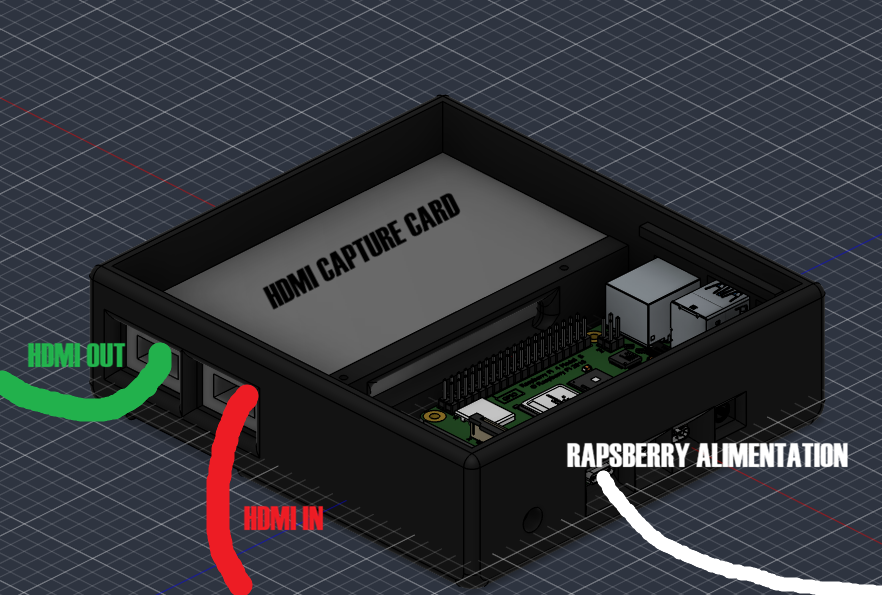
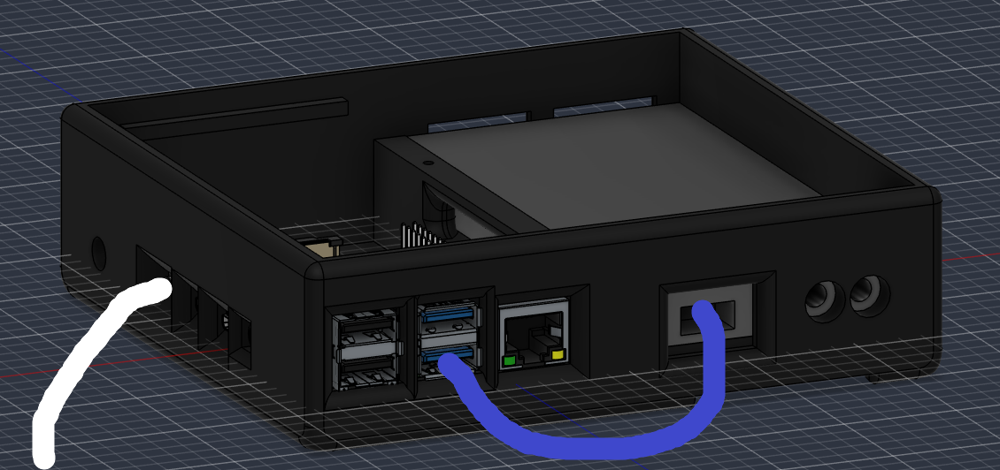

# Ambilight

A case for my actual TV ambientlight set up.

# Context

I already have a set up of ambientlight but it's really messy with cable everywhere. So, I wanted to design a box to contain everything together. But there was an other important point, it's that the rapsberry had to be easily reachable to use it for different purpose like a way to connect baffle which don't have the bluetooth.

# CAD

## The global case

## The bottom case

## The top case

## The interlayer top

# The connections

1) Connect the your source on the red wire and then connect the green one to your TV. You need to connect your rapsberry to an alimentation by the white wire.

2) Then connect the last port of the HDMI capture card to this USB port on the Rapsberry pi (the blue wire).
