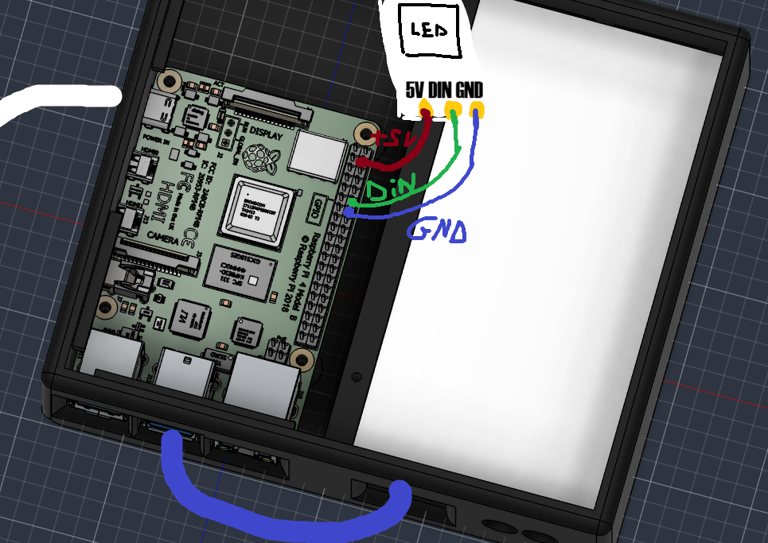
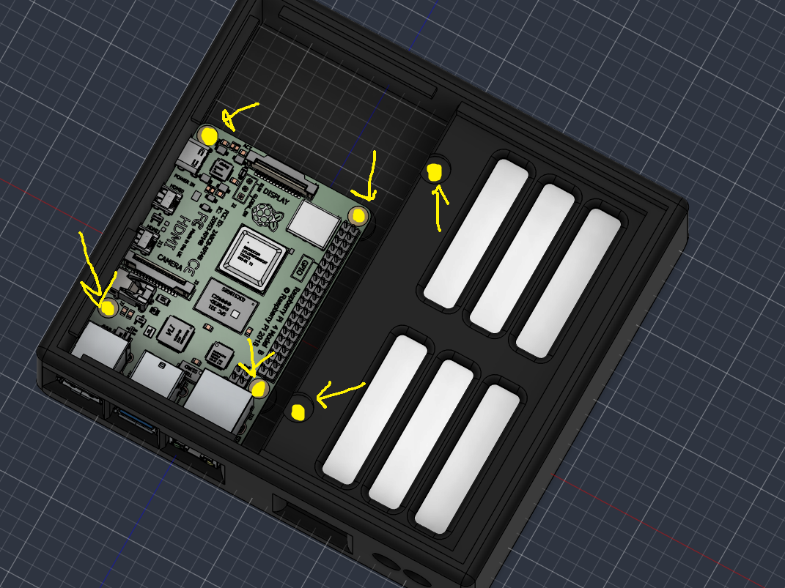

# Ambilight

A case for my actual TV ambientlight set up.


# Context

I already have a set up of ambientlight but it's really messy with cable everywhere. So, I wanted to design a box to contain everything together. But there was an other important point, it's that the rapsberry had to be easily reachable to use it for different purpose like a way to connect baffle which don't have the bluetooth.

# CAD

## The global case


## The bottom case


## The top case


## The interlayer top


# The connections

1) Connect the your source on the red wire and then connect the green one to your TV. You need to connect your rapsberry to an alimentation by the white wire.


2) Then connect the last port of the HDMI capture card to this USB port on the Rapsberry pi (the blue wire).


3) The led wiring. 

Connect the 5V on the pin 4, The DIN on the pin 12 and the GND on the pin 14.


4) Fix the all thing. There is six M2 screw to put in heat insert which need to be placed at the bottom of the box. The top case doesn't have any fixation, it's just put on top.


# The software part

#### - Install the OS

        Download and install Raspberry Pi Imager.

        Select:

        Raspberry Pi 4
        └── Raspberry Pi OS Lite (64-bit)

        During the installation, configure : Hostname, Wi-Fi, Username and password, SSH

        Raspberry Pi OS Lite is recommended for a headless AmbientLight setup.

#### - Boot the Raspberry Pi

Insert the microSD card and power on the Raspberry Pi.
Connect through SSH:
```bash
ssh <username>@<hostname>.local
```
Update the system:
```bash
sudo apt update
sudo apt upgrade -y
```

#### - Install [Hyperion](https://docs.hyperion-project.org/)

And configure it like you want. The documentation is [here](https://docs.hyperion-project.org/user/leddevices/Overview.html). 